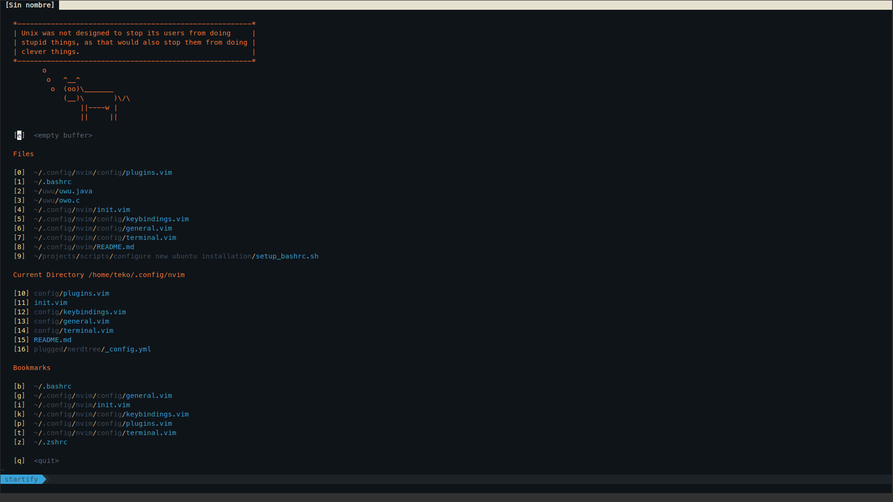

# nvim-config



# Index
- [Installation](#Installation)
- [Plugin configuration](#Plugin-configuration)
  - [Airline & NerdTree](#Airline-&-NerdTree)
  - [Coc](#Coc)
    - [coc-java](#coc-java)
    - [coc-clangd](#coc-clangd)
- [Plugins included](#Plugins-included)
  - [General use](#General-use)
  - [Git](#Git)
- [Keybindings](#Keybindings)
  - [General use](#General-use)
  - [Plugins](#Plugins)

# Installation
Clone this repo on ~/.config/nvim by running

`git clone https://github.com/Tekofx/nvim-config.git`


# Plugin configuration
## Requirements
To install all dependencies run:

`sudo pacman -S python3 python2 nodejs npm python3-pip python2-pip`

We will need vim-plug to manage plugins. To install it run:

```sh
sh -c 'curl -fLo "${XDG_DATA_HOME:-$HOME/.local/share}"/nvim/site/autoload/plug.vim --create-dirs \
       https://raw.githubusercontent.com/junegunn/vim-plug/master/plug.vim'
```

To install all plugins in the init.vim run :

`:PlugInstall` on Neovim

or

`nvim +PlugInstall +qa` on the command line

## Airline & Nerdtree
This two plugins need an special font to show icons, I recommend [Meslo](https://github.com/romkatv/powerlevel10k-media/raw/master/MesloLGS%20NF%20Regular.ttf).
You will need to change your terminal font to Meslo


## Coc
Make sure you have installed Nodejs with Brew, if not run:

`/bin/bash -c "$(curl -fsSL https://raw.githubusercontent.com/Homebrew/install/master/install.sh)"`

`echo 'eval $(/home/linuxbrew/.linuxbrew/bin/brew shellenv)' >> ~.profile`

`eval $(/home/linuxbrew/.linuxbrew/bin/brew shellenv)`

`brew install node`


### coc-java
Add the JDK path to your PATH.


### coc-clangd
Install clangd with:

`:CocCommand clang.install`

Add the clangd path to your PATH. If you used the command above it should be on:
~/.config/coc/extensions/coc-clangd-data/install/10.0.0/clangd_10.0.0/bin/


## Plugins included

### General use
- **NerdTree**: Tree explorer
- **fzf**: Fuzzy finder
- **Airline**: Status line
- **Airline-themes**: Customize airline
- **Coc**: Completion tool
- **Devicons**: Icons for NerdTree
- **Vim-auto-save**: Autosave buffer

### Git
- **Signify**: Show git info at left comlumn
- **Fugitive**: Git commands in neovim
- **Rhubarb**: See GitHub repo on browser
- **Nerdtree-git-plugin**: See git info on Nerdtree


# Keybindings
## General use

| Shortcut                                      | Action                              |
| --------------------                          | ----------------------------------- |
| <kbd>Space</kbd>                              | Leader Key                          |
| <kbd>Tab</kbd>                                | Change between opened buffers       |
| <kbd>Ctrl</kbd>+<kbd>t</kbd>                  | Open terminal                       |
| <kbd>Space </kbd>+<kbd>s</kbd>                | Save buffer                         |
| <kbd>Space</kbd>+<kbd>q</kbd>                 | Quit neovim                         |
| <kbd>Alt</kbd>+<kbd>h</kbd>                   | Go to left panel                    |
| <kbd>Alt</kbd>+<kbd>j</kbd>                   | Go to bottom panel                  |
| <kbd>Alt</kbd>+<kbd>k</kbd>                   | Go to top panel                     |
| <kbd>Alt</kbd>+<kbd>l</kbd>                   | Go to right panel                   |


### Plugins
| Shortcut                                      | Action                              |
| --------------------                          | ----------------------------------- |
| <kbd>Space</kbd>+<kbd>b</kbd>                 | Toggle NerdTree                     |
| <kbd>Space</kbd>+<kbd>p</kbd>                 | Fzf search                          |
| <kbd>Tab</kbd>                                | Navigate between options on coc     |
