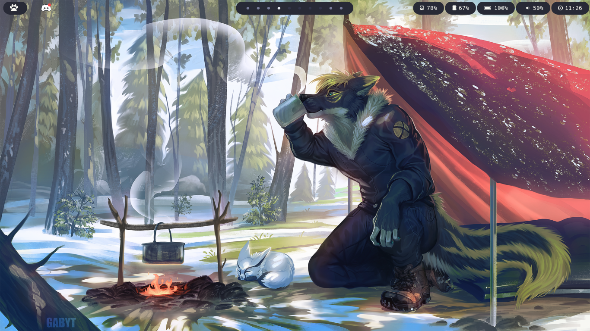

# Dotfiles
> All my configuration files for Arch



## Usage
Clone this repo and copy the configs you like:
```
git clone https://github.com/tekofx/dotfiles.git
```

For more info see the  [wiki](https://github.com/Tekofx/dotfiles/wiki)


## TODO
- Add blur to terminal
- Config opacity for more programs
- Fix opacity at using navi
